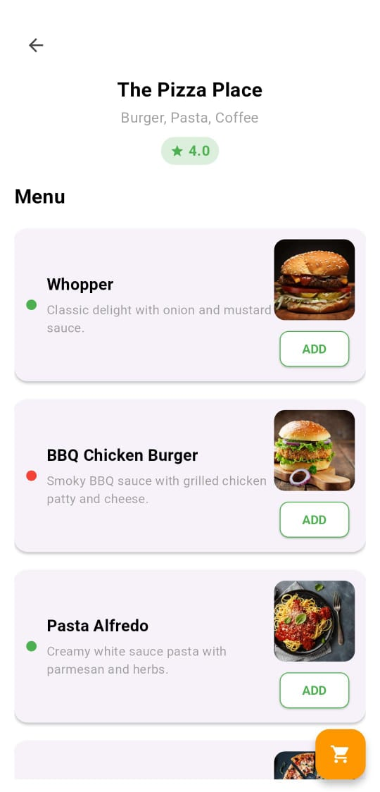
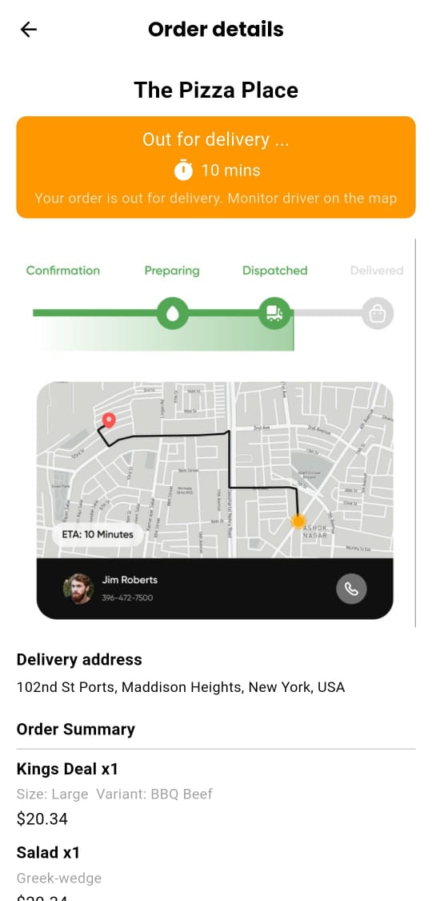

# 🍔 Food Ordering App UI

A modern and visually appealing **Food Ordering App UI** built using **Flutter**. This project focuses on crafting a seamless and clean user interface for a food delivery application.

---

## 🚀 Features

- 🛒 Home screen with featured foods
- 🔍 Search functionality UI
- 🍽️ Categories and filters
- 📄 Food details page with price, rating, description
- 🛍️ Add to cart button UI
- 🎨 Beautiful, minimal, and responsive layout

---

## 📸 Screenshots

<div align="center">
  
  
  
</div>

---

## 🛠️ Tech Stack

- **Flutter**
- **Dart**
- **Material Design**


---

## 📦 Getting Started

```bash
# 1. Clone the repository
git clone https://github.com/AnshAggr1303/food-ordering-app-UI.git

# 2. Navigate to the project directory
cd food-ordering-app-UI

# 3. Get Flutter packages
flutter pub get

# 4. Run the app
flutter run
```
---

## 💡 Notes

- This project is UI-only and does not contain backend or database integration.
- Feel free to use this as a starting point for your own food delivery app.

---

## 🤝 Contributing

Contributions are always welcome!

If you'd like to improve the UI, fix a bug, or suggest a new feature, feel free to fork the repository and submit a pull request. Here's how you can contribute:

1. **Fork** the repository  
2. **Create a new branch**: `git checkout -b feature/YourFeatureName`  
3. **Make your changes**  
4. **Commit your changes**: `git commit -m 'Add some feature'`  
5. **Push to the branch**: `git push origin feature/YourFeatureName`  
6. **Open a pull request**  

Please ensure your code follows the project's coding conventions and is properly documented.

---

## 📬 Contact

For any questions, suggestions, or collaborations, feel free to reach out:

- **Name**: Ansh Agrawal  
- **Email**: [anshagrawal2005@gmail.com](mailto:anshagrawal148@gmail.com)  
- **GitHub**: [AnshAggr1303](https://github.com/AnshAggr1303)  

